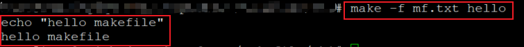

### 一.make与makefile简介

****

[TOC]

#### 1.make是什么，为什么需要make?

make是一个应用程序

* **解析源程序之间的依赖关系**
* 根据依赖关系**自动维护**编译工作
* 执行宿主操作系统中的各种命令（比如Linux里面的shell脚本命令）

#### 2.makfile是什么，为什么需要makfile？

makefile是一个描述文件

makefile是一个描述文件

* **定义一系列的规则**来指定源文件编译的先后顺序
* 拥有**特定的语法规则**，支持函数定义含函数调用
* 能够**直接集成**操作系统中的各种命令

#### 3.make和makefile的关系

makefile中的描述用于直到make程序如何完成工作；

make根据makfile中的规则去执行相对应的命令，最后完成编译输出；

**通俗上来说:make就是一门脚本语言的解释器，专门用于解析makefile这种用于管理源文件依赖关系的脚本语言；**

#### 4.最简单的makefile示例

```makefile
hello:					 # 目标
	echo "hello makfile" # 实现目标所需要执行的命令
						 # 注意点：目标之后的命令是用Tab键('\t')隔开，不是空格
						 # 文件名为mf.txt
```

#### 5.make程序的使用示例

```makefile
make -f mf.txt hello     # 以hello为关键字作为目标查找mf.txt文件，并且执行hello处的命令
```

#### 6.实验截图



#### 7.小结

make只是一个具有**特殊功能**的应用程序

make用于根据指定的目标**执行相应的命令**

makefile用于**定义目标**和**实现目标**所需要的**命令**

makefile有特定的语法规则，支持函数定义和调用