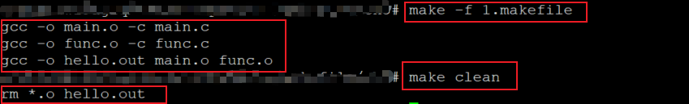
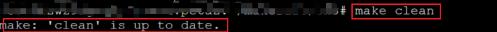
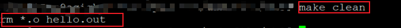
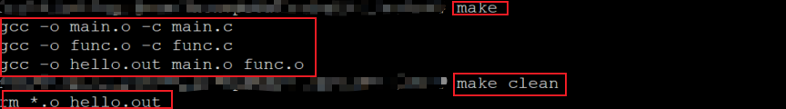

### 伪目标的引入

****

思考一下makefile中的目标究竟是什么？

**在默认情况下：**

* make将makefile的**目标认为是一个文件**；

* make**比较目标文件和依赖文件的新旧关系**，决定是否执行命令；

* make以**文件处理**作为第一优先级。

**编程实验：有趣的目标**

```makefile
hello.out all : main.o func.o
	gcc -o hello.out main.o func.o
main.o: main.c
	gcc -o main.o -c main.c
func.o: func.c
	gcc -o func.o -c func.c

#.PHONY:clean
clean:
	rm *.o hello.out
```

执行make，执行make clean

正常情况下，执行make clean会把当前目录下的*.o hello.out文件全部删除。但是如果我们在当前目录下新建一个名字为clean的文件，然后再执行make clean，此时会提示clean文件是最新的。

出现这个问题的原因是：make解释器默认将clean目标当作一个文件处理，而不是一个标签。如果将clean当成一个文件，当make发现当前目录下有这个文件，并且此目标没有依赖，便会被make认为目标是最新的。所以make给出了clean是最新的提示。

那么怎么解决这个问题呢？

使用伪目标

****

#### 伪目标的引入

伪目标的语法：**先声明，后使用**

* 本质上：伪目标是make中特殊的目标.PHONY的依赖

  ```makefile
  .PHONY:clean
  ## 注释 ##
  clean:
  	rm *.o hello.out
  ```

**编程实验：使用伪目标**

```makefile
hello.out all : main.o func.o
	gcc -o hello.out main.o func.o
main.o: main.c
	gcc -o main.o -c main.c
func.o: func.c
	gcc -o func.o -c func.c

.PHONY:clean
clean:
	rm *.o hello.out
```

**实验截图：**



.PHONY该关键字是用于定义一个伪目标，所谓伪目标指的是目标不再对应任何实际的文件，make不再将伪目标当作文件处理，而是当成一个标签。无论伪目标的依赖是否更新，当前是否存在一个名为clean的文件，命令总是会被执行。

*****

**伪目标的妙用：规则调用(函数调用)**

```makefile
.PHONY : clean rebuild all
## other rules ##
rebuild : clean all   #原理：当一个目标的依赖包含伪目标时，伪目标所定义的命令总是会被执行

clean :
	rm *.o hello.out
```

定义三个伪目标，当我们执行make rebuild时，clean目标对应的规则会先被执行，然后执行all目标对应的规则。原理为：当一个目标的依赖包含伪目标时，伪目标所定义的命令总是会被执行。这样就完成了规则调用的目的，执行rebuild规则，该规则调用clean和all规则。

**技巧：绕开.PHONY关键字定义伪目标**

**原理：**

​	如果一个规则没有命令或者依赖，并且它的目标不是一个存在的文件名；在执行此规则时，目标总会被认为是最新的。

```makefile
clean : FORCE
	rm *.o hello.out
FORCE:
```

定义一个目标FORCE，由于目标没有依赖，并且在规则下也没有命令，让clean依赖这个目标。此时，当前路径下存在clean文件，执行make clean时，clean目标对应的命令会被执行。

**编程实验：伪目标的高级应用**

```makefile
hello.out all : main.o func.o
	gcc -o hello.out main.o func.o
main.o: main.c
	gcc -o main.o -c main.c
func.o: func.c
	gcc -o func.o -c func.c
clean: FORCE
	rm *.o hello.out
FORCE:
```

实验截图：



****

#### 小结:

	* 默认情况下，make认为目标对应着一个文件
	* .PHONY用于声明一个伪目标，伪目标不对应实际的文件
	* **伪目标的本质是make中特殊目标.PHONY的依赖**
	* 使用伪目标可以模拟“函数调用”

 
