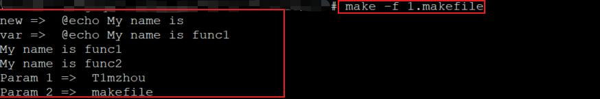

### 函数定义及调用

****

#### makefile中支持函数的概念

* make解释器**提供了一系列的函数**供makefile调用
* 在makefile中**支持自定义函数实现**，并调用执行
* 通过**define**关键字实现自定义函数

#### 自定义函数的语法

```makefile
# 函数定义
define func1
	@echo "My name is $(0)"
endef

define func2
	@echo "My name is $(0)"
	@echo "Param => $(1)"
# 函数调用
test :
	$(call func1)
	$(call func2, Timzhou)
```

#### 深入理解自定义函数

* 自定义函数是**一个多行变量**，无法直接调用
* 自定义函数是一个过程调用，**没有任何的返回值**
* 自定义函数**用于定义命令集合**，并应用于规则中

#### 编程实验：

```makefile
.PHONY : test

define func1
	@echo "My name is $(0)"
endef

define func2
	@echo "My name is $(0)"
	@echo "Param 1 => $(1)"
	@echo "Param 2 => $(2)"
endef

var := $(call func1)
new := $(func1)

test :
	@echo "new => $(new)"
	@echo "var => $(var)"
	$(call  func1)	
	$(call func2, T1mzhou, makefile)
```

**实验截图：**



****

#### make解释器中的预定义函数

* make的函数提供了处理文件名，变量和命令的函数
* 可以在需要的地方**调用函数来处理指定的参数**
* 函数在**调用的地方被替换为处理结果**

#### 预定义函数的调用

```makefile  
 var := $(func_name arg1, arg2, ....)
# 返回值    函数名    函数实参

var := $(abspath ./)
test :
	@echo "var => $(var)"
```

**问题：**

为什么**自定义函数**和**预定义函数**的调用形式完全不同？

#### 本质剖析

* makefile中**不支持**真正意义上的自定义函数
* 自定义函数的**本质是多行变量**
* 预定义的call函数在调用时将参数传递给多行变量
* **自定义函数是call函数的实参**，并在call中被执行

#### 编程实验

**函数剖析**

```makefile
.PHONY : test

define func1
	@echo "My name is $(0)"
endef

define func2 
	@echo "My name is $(0)"
endef

var1 := $(call func1)
var2 := $(call func2)
var3 := $(abspath ./)
var4 := $(abspath test.cpp)

test :
	@echo "var1 => $(var1)"
	@echo "var2 => $(var2)"
	@echo "var3 => $(var3)"
	@echo "var4 => $(var4)"
```

**实验截图：**


***

小结

* make解释器提供了**一系列的函数供**makefile调用
* 自定义函数是**一个多行变量，无法直接调用**
* 自定义函数用于**定义命令集合**，并应用于规则中
* 预定义的call函数在调用时将参数传递给多行变量
* **自定义函数时call函数的实参**，并在call中被执行