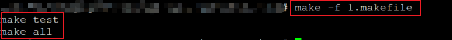

### 初识makefile的结构

****

#### makefile的意义

* makefile用于定于源文件之间的依赖关系
* makefile说明如何编译各个源文件并生成可执行文件

```makefile
# 一个最基本的依赖的规则如下:
target : prerequisites ; command1
'\t'command2
```

#### makefile中的元素含义

* **targets**
  * 通常是需要生成的目标文件名
  * make所需执行的命令名称（例如：all）

* **prerequisities**
  	* 当前目标所依赖的其他目标或者文件

* **command**
  * 完成目标所需要执行的命令或者动作；
  * 两种写法
    * 写成command1的形式，和依赖写在同一行，通过**分号隔开**将两者隔开。
    * 写成command2的形式，写在依赖的下一行，并以**tab键开头**(make解释器进行解释时，会知道这是一个命令行)，也可以使用续行符“\”将内容分开写到下一行，提高makefile的可读性。

#### 规则中的注意事项

* **[Tab]键：‘\t’**
  * 每个命令行必须以[Tab]字符开始
  * [Tab]字符告诉make此行时一个命令行

* **续行符： ’\‘**
  	*    可以将内容分开写道下一行，提高整体的可读性

　　一个简单的makefile如下:

#### 　一个makefile的依赖示例

```makefile
all : test
	echo "make all"
test :
	echo "make test"
```

　　上面所展示的makfile中，all目标依赖test目标，所以必须要test存在，才能保证all目标执行echo "make all"命令完成目标。test目标没有依赖，所以只需要执行echo "make test"即可完成其目标。

　**实验截图**



#### 　依赖规则

　* **当目标对应的文件不存在**，执行对应的命令。
　* **当依赖在时间上比目标更新**，执行对应的命令。
　* **当依赖关系连续发生时**，对比依赖链上的每一个目标。

#### 小技巧

* makefile中可以在命令前加上**@**符号，**作用为命令无回显**；（可以解决第一课中打印回显命令的问题）　　

***

#### 第一个make的编译案例

```makefile
hello.out : main.o func.o
	gcc -o hello.out main.o func.o
main.o : main.c
	gcc -o main.o -c main.c
func.o : func.c
	gcc -o func.o -c func.c
```

**依赖关系如下图所示：**

　　　　　　　　　　　　　　

　	hello.out需要func.o和main.o的存在，并且执行对应的命令才能完成。main.o依赖于main.c，并执行相应命令才能完成。func.o依赖func.c，并执行相应命令才能完成。

**实验结果：**


​	  如果我们修改main.c，再次执行make，func.o没有被重新生成，而只有main.o和hello.out的目标对应的命令被执行了。因为func.o存在，且在时间上比 func.c更新，所以该目标对应的命令不会执行，无需重新生成func.o文件。

****

将hello.out目标改为all，如下所示:

```makefile
all : main.o fun.o
	gcc -o hello.out main.o func.o
main.o : main.c
	gcc -o main.o -c main.c
func.o : func.c
	gcc -o func.o -c func.c
```

　　当我们再次执行make时，gcc -o hello.out main.o func.o，这句命令总会执行，即使依赖文件并没有更新，这是因为在当前目录下并没有一个名为all的文件存在，所以make在解析makefile时，会按照依赖规则的第一条进行解析，因此，命令会被执行。

***

**实验结果**：


***

将hello.out和all目标写在一起又会发生什么？

```makefile
hello all : main.o fun.o
	gcc -o hello.out main.o func.o
main.o : main.c
	gcc -o main.o -c main.c
func.o : func.c
	gcc -o func.o -c func.c
```

  	当执行make时，make解释器默认的目标是为hello.out。如果当前目录下会存在hello.out文件，当依赖(即func.c main.c文件)不改变时，执行make命令不会去更新最终的可执行文件，仅仅给出文件是最新的提示。

**实验结果**：


***

#### 小结：

* makfile用于定义源文件间的**依赖关系**
* makefile说明如**何编译各个源文件**并**生成可执行文件**
* makefile中的目标之间存在**连续依赖关系**
* 依赖存在并且命令执行成功是目标完成的充要条件
