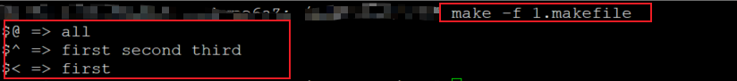
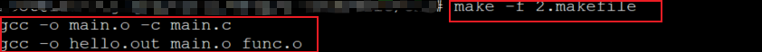
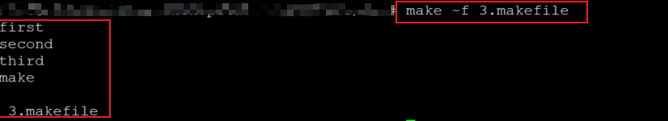
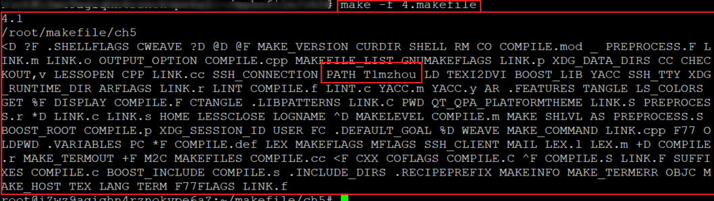

### 预定义变量的使用

****

#### 在makefile中存在一些预定义的变量

* **自动变量**
  * $@, $^, $<
* **特殊变量**
  * $(MAKE), $(MAKECMDGOALS),$(MAKEFILE_LIST)
  * $(MAKE_VERSION),$(CURDIR),$(.VARIABLES)
  * ....

####  自动变量的意义

* $@
  * 当前规则中触发命令被执行的目标
* $^
  * 当前规则中所有依赖
* $<
  * 当前规则中的第一个依赖

#### 预定义变量的使用

* 自动变量的使用示例

  ```makefile
  all : first second third
  	@echo "\$$@ => $@"
  	@echo "$$^ => $^"
  	@echo "$$< => $<"
  ```

  实验截图：

   

**注意：**

* “$”对于makefile由特殊含义
  * 输出时需要加上一个'$'进行转义

* “$@”对于Bash Shell有特殊的含义
  * 输出时需要加上“\”进行转义

***

**编程实验：**

```makefile
CC := g++
TARGET := hello-world.out

$(TARGET) : func.o main.o
	$(CC) -o $@ $^

func.o : func.c
	$(CC) -o $@ -c $^

main.o : main.c
	$(CC) -o $@ -c $^

.PHONY : rebuild clean all

rebuild : clean all


all : $(TARGET)

clean :
	$(RM) *.o $(TARGET)
```

**实验截图：**

 

***

**一些特殊的变量含义**

* $(MAKE)
  * 当前make解释器文件名

* $(MAKECMDGOALS)
  * 命令行中指定的目标名(make的命令行参数)

* $(MAKEFILE_LIST)

  * make所需要处理的makefile文件列表

  * 当前makefile的 文件名总是位于列表的最后

  * 文件名之间以空格进行分隔

**编程实验：预定义变量示例一**

```makefile

.PHONY : all out first second third test

all out : 
	@echo "$(MAKE)"
	@echo "$(MAKECMDGOALS)"
	@echo "$(MAKEFILE_LIST)"
	
	
first :
	@echo "first"
	
second :
	@echo "second"
	
third :
	@echo "third"
	
test :
	@$(MAKE) first
	@$(MAKE) second
	@$(MAKE) third
```

**实验截图：**



***

* $(MAKE_VERSION)
  * 当前make解释器的版本

* $(CURDIR)
  * 当前make解释器的工作目录

* $(.VARIABLES)
  * 所有已经定义的变量名列表(预定义变量和自定义变量)

**编程实验：预定义变量示例二**

```makefile
.PYTHONY : test1 test2

T1mzhou := tim zhou

test1:
	@echo "$(MAKE_VERSION)"
	@echo "$(CURDIR)"
	@echo "$(.VARIABLES)"
test2: 
	@echo "$(RM)"
```

**实验截图：**



#### 小结：

* makefile提供了预定义变量供开发者使用
* 预定义变量的使用能够使得makefile的开发更高效
* 自动变量是makefile中最常见的元素
* 使用$(.VARABLES)能够获取所有的特殊变量