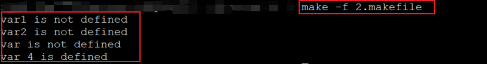

### 条件判断语句

****

#### 条件判段语句

* **注意事项**
  
* 条件判断语句只能用于控制make实际执行的语句；但是，不能控制规则中命令的执行过程
  
* **条件判断语句的语法说明**

  * 常见形式
    
* ifxxx (arg1, arg2)
    
  * 其它合法形式
    * ifxxx "arg1" "arg2"
    * ifxxx  'arg1' 'arg2'
    * ifxxx "arg1" 'arg2'
  * ifxxx 'arg1' "arg2"
  
* 小贴士
  
    ```makefile
    ifxxx (arg1,arg2)
    # if前面，xxx后面和(arg1,arg2)后面都可以使用空格
    # (arg1,arg2)参数中间不能使用空格
  ```

* **条件判断关键字**

  | 关键字 | 功能                                             |
  | ------ | ------------------------------------------------ |
  | ifeq   | 判断参数**是否相等**，相等为true,否则为false     |
  | ifneq  | 判断参数**是否不相等**，不相等为true,否则为false |
  | ifdef  | 判断参数**是否有值**，有值为true,否则为false     |
  | ifndef | 判断参数**是否没有值**，没有值为true,否则为false |

* **编程实验：**

  条件判断语句初探

  ```makefile
  .PHONY : test
  
  var1 := A
  var2 := $(var1)
  var3 :=					              # 定义一个没有值的变量
  
  test:
      ifeq ($(var1),$(var2)) 		# 前面使用空格
  		@echo "var1 == var2"	    # 前面使用tab
      else
  		@echo "var1 != var2" 	
      endif
      
      ifneq ($(var2),)
  		@echo "var2 is NOT empty"    
      else
  		@echo "var2 is empty"    
      endif
      
      ifdef var2
  		@echo "var2 is NOT empty"    
      else
  		@echo "var2 is empty"    
      endif
      
      ifndef var3
  		@echo "var3 is empty"    
      else
  		@echo "var3 is NOT empty"    
      endif
  ```

  **实验截图：**

  

* **一些工程经验**
  * 条件判断语句之前可以有空格，**但不能有Tab字符('\t')**
  * 在条件语句中**不要使用自动变量**($@, $^, $<)
  * 一条完整的条件语句**必须**位于同一makefile中
  * 条件判断类似C语言中的宏，**预处理阶段有效**，**执行阶段无效**
  * make在加载makefile时
    * 首先计算表达式的值(赋值方式不同，**计算方式不同**)
    * 根据**判断语句的表达式**决定执行的内容

* 编程实验

  深入make行为

  ```makefile
  .PHONY : test
  
  var1 := 
  var2 := $(var1)
  
  var3 :=		    # 定义了一个没有值的变量
  var4 = $(var3)  # 递归赋值，无法在预处理时判断是否被定义所以var4打印出已经被定义
  
  test:
      ifdef var1
  	@echo "var1 is defined"
      else
  	@echo "var1 is not defined"
      endif
    
      ifdef var2
  	@echo "var2 is defined"
      else
  	@echo "var2 is not defined"
      endif
  
      ifdef var3
  	@echo "var3 is defined"
      else
  	@echo "var is not defined"
      endif
  
      ifdef var4
  	@echo "var 4 is defined"
      else
  	@echo "var4 is not defined"
      endif
  ```

  **实验截图：**



****

#### 小结

* 条件判断根据体哦阿健的值来决定make的执行
* 条件判断可以比较**两个不同变量**或者**变量和常量值**
* 条件判断在**预处理阶段有效**，执行阶段无效
* 条件判断**不能控制规则中命令的执行过程**

