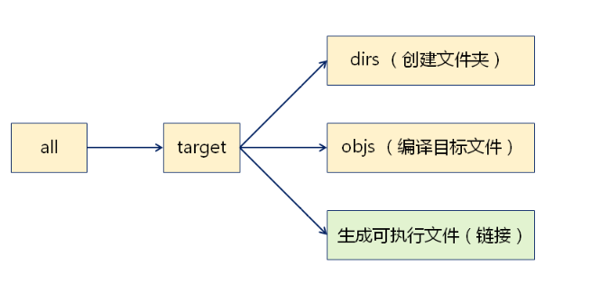
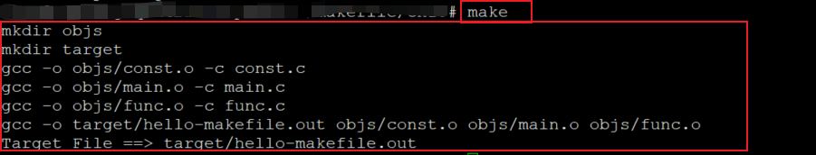

### 第十课-变量与函数的综合示例

****

#### 实战需求

* 自动生成**target文件夹**存放可执行文件
* 自动生成**objs文件夹**存放编译生成的目标文件(*.o)
* 支持**调试版本**的编译选项
* 考虑代码的拓展性

#### 工具原料

* $(wildcard _pattern)
  * 获取当前工作目录中满足_pattern的文件或目录列表

* $(addprefix _prefix, _names)
  * 给名字列表`_names`中的每个名字增加前缀`_preix`

#### 关键技巧

* 自动获取当前目录下的源文件列表(函数调用)
  * SRCS := $(wildcard *.c)

* 根据源文件列表生成目标文件列表(变量的值替换)
  * OBJS := $(SRCS: .c = .o)

* 对每个目标文件列表加上路径前缀(函数调用)
  * OBS := $(addprefix path/, $(OBJS))

#### 规则中的模式替换(目录结构

* 工作目录中存在func.c和main.c

```makefile
%.o : %.c
	gcc -o $@ -c $^
# 等同于
func.o : func.c
	gcc -o $@ -c $^
main.o : main.c
	gcc -o $@ - c $^
```

#### 编译规则的依赖



#### 编程实验

```makefile
CC := gcc
MKDIR  := mkdir
RM := rm -rf

DIR_OBJS := objs
DIR_TARGET := target

DIRS := $(DIR_OBJS) $(DIR_TARGET)

TARGET := $(DIR_TARGET)/hello-makefile.out
# main.c const.c func.c
SRCS := $(wildcard *.c)
# main.o const.o func.o
OBJS := $(SRCS:.c=.o)
# objs/main.o objs/const.o objs/func.o
OBJS := $(addprefix $(DIR_OBJS)/, $(OBJS))

.PHONY : rebuild clean all

$(TARGET) : $(DIRS) $(OBJS)
	$(CC) -o $@ $(OBJS)
	@echo "Target File ==> $@"
	
$(DIRS) :
	$(MKDIR) $@

$(DIR_OBJS)/%.o : %.c
    ifeq ($(DEBUG),true)
	$(CC) -o $@ -g -c $^
    else
	$(CC) -o $@ -c $^
    endif

rebuild : clean all

all : $(TARGET)

clean : 
	$(RM) $(DIRS)
```

**实验截图：**



#### 小结

* **目录可以成为目标的依赖**，在规则中创建目录
* **预定义函数**是makefile实战时不可或缺的部分
* 规则中的模式匹配可以**直接针对目录中的文件**
* 可以使用命令行变量编译特殊的目标版本