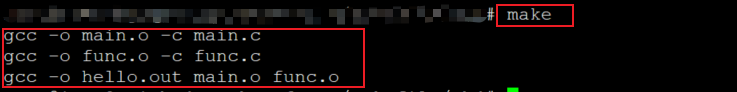
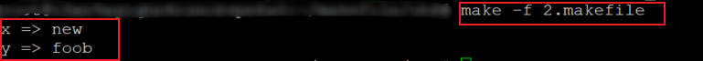
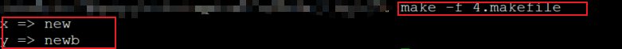
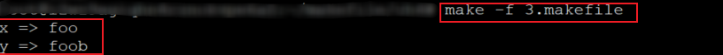
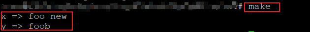

### 变量和不同的赋值方式

****

makefile支持程序设计语言中变量的概念。但makefile里面的变量代表**文本数据(即字符串**)。makefile中的变量命名规则和C语言中相似。

* 变量名可以包含字符、数字、下划线。

* 不能包含":"、"#"、"="或" "。

* 变量名大小写敏感。

#### 变量的定义和使用：

```makefile
CC := gcc								# 变量定义
TARGET := hello.out						# 变量定义

$(TARGET) : func.o main.o				# $(var) 变量使用
	$(CC) -o $(TARGET) func.o main.o	#  变量使用
```

具体释义：CC变量赋值为gcc字符串，TARGET变量被赋值为hello.out字符串，变量的使用需要使用$(变量名称)的形式来引用变量。上图的规则中目标为$(CC)就代表gcc字符串。类似于C语言中的宏定义。

#### 编程实验：变量定义和使用

```makefile
CC := gcc
TARGET := hello.out

$(TARGET) : main.o func.o
	$(CC) -o $(TARGET) main.o func.o

main.o: main.c
	$(CC) -o main.o -c main.c
func.o: func.c
	$(CC) -o func.o -c func.c

.PHONY : rebuild clean all

rebuild : clean all
all : $(TARGET)
clean : 
	rm *.o $(TARGET)

```

#### 实验截图：



****

#### makefile中变量的赋值方式：

* 简单赋值( := )

* 递归赋值( = )

* 条件赋值( ?= )

* 追加赋值( += )

**1.简单赋值( := )**

* 程序设计语言中的通用赋值方式

* 只针对当前语句的变量有效

  ```makefile
  x := foo
  y := $(x)b
  x := new
  
  .PHONY : test
  test :
  	@echo "x => $(x)"		# x => new
  	@echo "y => $(y)"		# y => foob
  ```

**2.递归赋值( = )**

* 赋值操作可能影响多个其它变量

* 所有与目标变量相关的其他变量都将受到影响

  ```makefile
  x = foo
  y = $(x)b
  x = new
  
  .PHONY : test
  test :
  	@echo "x => $(x)"		# x => new
  	@echo "y => $(y)"		# y => newb
  ```

**3.条件赋值( ?= )**

* 如果变量未定义，使用赋值符号中的值定义变量

* 如果变量已定义，赋值无效

  ```makefile
  x := foo
  y := $(x)b
  x ?= new
  
  .PHONY : test
  test :
  	@echo "x => $(x)"		# x => foo
  	@echo "y => $(y)"		# y => foob
  ```

  **4.追加赋值( += )**

* 原变量值之后加上一个新值

* 原变量值与新值之间由空格隔开

  ```makefile
  x = foo
  y = $(x)b
  x += $(y)
  
  .PHONY : test
  test :
  	@echo "x => $(x)"		# x => foo foob
  	@echo "y => $(y)"		# y => foob
  ```

  **注意**： makefile中的变量无须定义就可以直接引用，只不过此时引用变量的值为空。

#### **编程实验：不同的赋值方式**

**1.简单赋值**

实验截图：

**2.递归赋值**

实验截图：

 

**3.条件赋值**

实验截图：	

**4.追加赋值**

实验截图：

